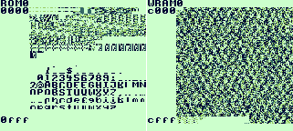

# memviewGB

About
-----
memviewGB is a memory viewer for Gameboy/Gameboy Color hardware.

Author
------
* Artur Rojek (zear)

Copying
-------
This program is released into public domain under the terms of [CC0 1.0 Universal Public Domain Dedication](https://creativecommons.org/publicdomain/zero/1.0/).

See [COPYING.txt](COPYING.txt) for more details.

